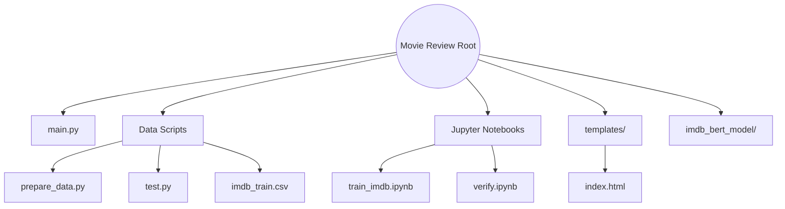

<div align="center">

<!-- Animated Typing Header -->


<p align="center">
  <strong>An end-to-end Machine Learning web application that analyzes movie reviews and predicts sentiment.</strong>
</p>

<p align="center">
  <a href="#-stack"></a>
  <a href="#-stack"></a>
  <a href="#-stack"></a>
  <a href="#-stack"></a>
  <a href="#-stack"></a>
</p>


</div>

## ✨ Key Features

- 🧠 **Transformer Architecture** — Customized and fine-tuned BERT models for industry-standard NLP text classification.
- ⚡ **GPU-Accelerated Processing** — Optimized model training and rapid inference leveraging CUDA on NVIDIA hardware.
- 🚀 **High-Performance API** — Asynchronous Python backend utilizing FastAPI for low-latency responses.
- 🎨 **Dynamic Interface** — Light-weight, server-side rendered UI utilizing Jinja2 templates.

<br>

## 🛠️ Stack

The project utilizes an end-to-end Machine Learning pipeline merged with a modern web backend.

**Core ML & Training 🧠**
>     

**Backend & Inference ⚙️**
>   

<br>


## 🚀 Development

### 📋 Prerequisites
Ensure you have the following installed on your local environment before proceeding:
- Python 3.8+
- Active internet connection for downloading Hugging Face models
- (Optional) NVIDIA GPU with CUDA for accelerated inference

### 💻 Setup

<details>
<summary><b>Environment Configuration ⚙️</b> (Click to Expand)</summary>

1. First, clone the repository and navigate into it:
```bash
git clone https://github.com/Bersinberz/Movie_review.git
cd Movie_review
```

2. Initialize a virtual environment:

**Windows:**
```bash
python -m venv venv
venv\Scripts\activate
```

**Mac / Linux:**
```bash
python3 -m venv venv
source venv/bin/activate
```
</details>

<details>
<summary><b>Dependencies Installation 📦</b> (Click to Expand)</summary>

Install the required packages based on your hardware capabilities:

**Using GPU Acceleration Engine (Recommended):**
```bash
pip install torch torchvision torchaudio --index-url https://download.pytorch.org/whl/cu121
pip install transformers fastapi uvicorn jinja2 pandas scikit-learn
```

**Using Standard CPU Processing:**
```bash
pip install torch transformers fastapi uvicorn jinja2 pandas scikit-learn
```
</details>

<br>


## ▶️ Running the Application

### 1️⃣ Launch the Server

Launch the high-performance application server directly through your command line:

```bash
python main.py
```

> 💡 **Tip:** The application will initialize the neural network and stream to [`http://127.0.0.1:8000`](http://127.0.0.1:8000).

### 2️⃣ Analyze a Review

Open the browser, paste a movie review into the UI, or send an API request:

**Model Output Example:**
```json
{
  "Sentiment": "Positive 😊",
  "Confidence": 0.9723
}
```

<br>


## 🗂️ Project Structure

Using Mermaid standard graphs, observe our full project overview separating logic models perfectly per target layer:



<br>

<div align="center">
  <sub>Built with ❤️ by Bersinberz. © 2026</sub>
</div>
